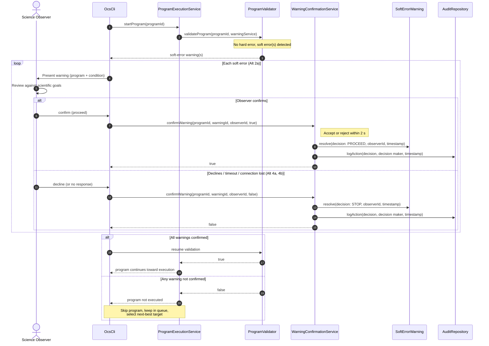

```mermaid
sequenceDiagram
    autonumber
    actor SO as Science Observer
    participant CLI as OcsCli
    participant EXE as ProgramExecutionService
    participant VAL as ProgramValidator
    participant WCS as WarningConfirmationService
    participant WRN as SoftErrorWarning
    participant AUD as AuditRepository

    CLI->>EXE: startProgram(programId)
    EXE->>VAL: validateProgram(programId, warningService)
    Note over VAL: No hard error, soft error(s) detected
    VAL-->>CLI: soft-error warning(s)

    loop Each soft error (Alt 2a)
        CLI->>SO: Present warning (program + condition)
        SO->>SO: Review against scientific goals

        alt Observer confirms
            SO->>CLI: confirm (proceed)
            CLI->>WCS: confirmWarning(programId, warningId, observerId, true)
            Note right of WCS: Accept or reject within 2 s
            WCS->>WRN: resolve(decision: PROCEED, observerId, timestamp)
            WCS->>AUD: logAction(decision, decision maker, timestamp)
            WCS-->>CLI: true
        else Declines / timeout / connection lost (Alt 4a, 4b)
            SO->>CLI: decline (or no response)
            CLI->>WCS: confirmWarning(programId, warningId, observerId, false)
            WCS->>WRN: resolve(decision: STOP, observerId, timestamp)
            WCS->>AUD: logAction(decision, decision maker, timestamp)
            WCS-->>CLI: false
        end
    end

    alt All warnings confirmed
        CLI->>VAL: resume validation
        VAL-->>EXE: true
        EXE-->>CLI: program continues toward execution
    else Any warning not confirmed
        VAL-->>EXE: false
        EXE-->>CLI: program not executed
        Note over EXE,CLI: Skip program, keep in queue,<br/>select next-best target
    end
```
