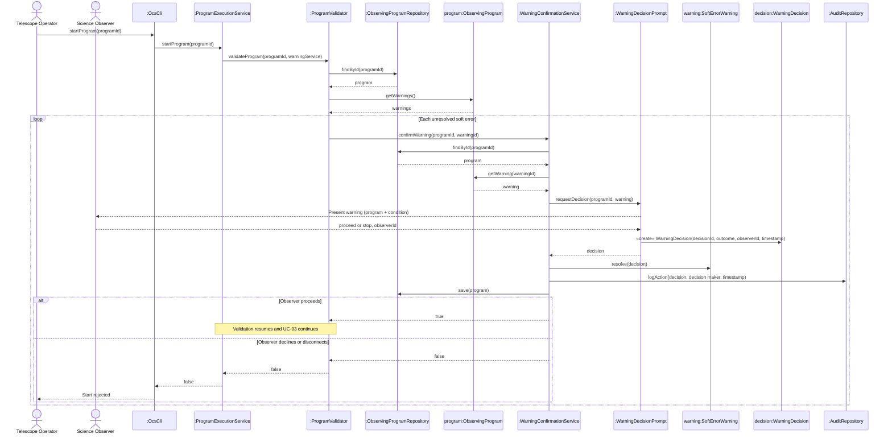

## Sequence Diagram: UC-01 Confirm Soft-Error Warning

```mermaid
sequenceDiagram
    actor TO as Telescope Operator
    actor SO as Science Observer
    participant CLI as :OcsCli
    participant EXE as :ProgramExecutionService
    participant VAL as :ProgramValidator
    participant REPO as :ObservingProgramRepository
    participant PROG as program:ObservingProgram
    participant WCS as :WarningConfirmationService
    participant PROMPT as :WarningDecisionPrompt
    participant WRN as warning:SoftErrorWarning
    participant DEC as decision:WarningDecision
    participant AUD as :AuditRepository

    TO->>CLI: startProgram(programId)
    CLI->>EXE: startProgram(programId)
    EXE->>VAL: validateProgram(programId, warningService)
    VAL->>REPO: findById(programId)
    REPO-->>VAL: program
    VAL->>PROG: getWarnings()
    PROG-->>VAL: warnings
    loop Each unresolved soft error
        VAL->>WCS: confirmWarning(programId, warningId)
        WCS->>REPO: findById(programId)
        REPO-->>WCS: program
        WCS->>PROG: getWarning(warningId)
        PROG-->>WCS: warning
        WCS->>PROMPT: requestDecision(programId, warning)
        PROMPT-->>SO: Present warning (program + condition)
        SO-->>PROMPT: proceed or stop, observerId
        PROMPT->>DEC: «create» WarningDecision(decisionId, outcome, observerId, timestamp)
        PROMPT-->>WCS: decision
        WCS->>WRN: resolve(decision)
        WCS->>AUD: logAction(decision, decision maker, timestamp)
        WCS->>REPO: save(program)
        alt Observer proceeds
            WCS-->>VAL: true
            Note over VAL,EXE: Validation resumes and UC-03 continues
        else Observer declines or disconnects
            WCS-->>VAL: false
            VAL-->>EXE: false
            EXE-->>CLI: false
            CLI-->>TO: Start rejected
        end
    end
```
