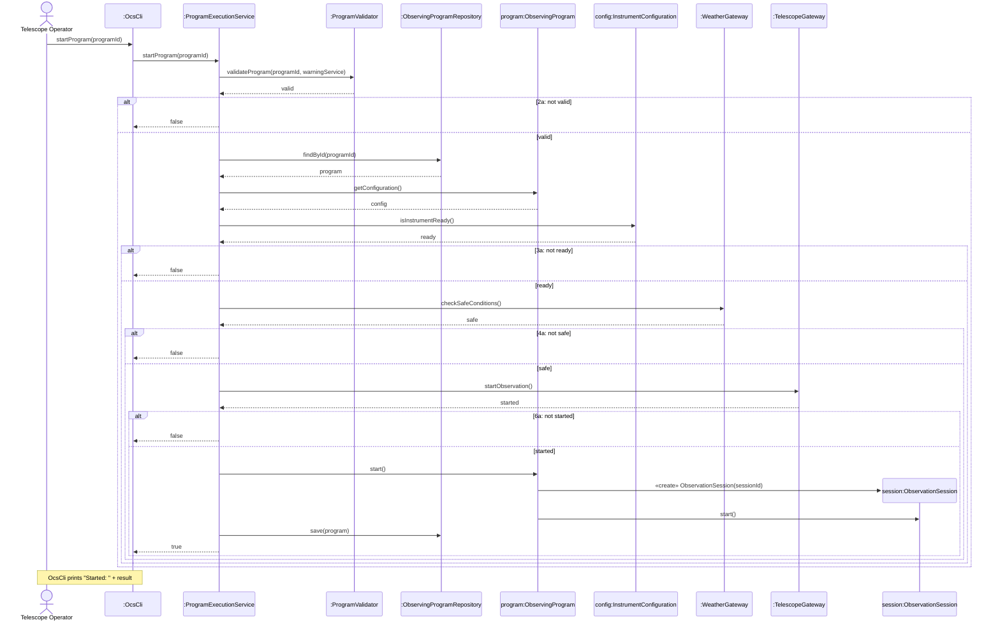

## Sequence Diagram: UC-03 Start Observing Program

```mermaid
sequenceDiagram
    actor TO as Telescope Operator
    participant cli as :OcsCli
    participant svc as :ProgramExecutionService
    participant val as :ProgramValidator
    participant repo as :ObservingProgramRepository
    participant prog as program:ObservingProgram
    participant cfg as config:InstrumentConfiguration
    participant wx as :WeatherGateway
    participant tel as :TelescopeGateway

    TO->>cli: startProgram(programId)
    cli->>svc: startProgram(programId)
    svc->>val: validateProgram(programId, warningService)
    val-->>svc: valid
    alt 2a: not valid
        svc-->>cli: false
    else valid
        svc->>repo: findById(programId)
        repo-->>svc: program
        svc->>prog: getConfiguration()
        prog-->>svc: config
        svc->>cfg: isInstrumentReady()
        cfg-->>svc: ready
        alt 3a: not ready
            svc-->>cli: false
        else ready
            svc->>wx: checkSafeConditions()
            wx-->>svc: safe
            alt 4a: not safe
                svc-->>cli: false
            else safe
                svc->>tel: startObservation()
                tel-->>svc: started
                alt 6a: not started
                    svc-->>cli: false
                else started
                    svc->>prog: start()
                    create participant sess as session:ObservationSession
                    prog->>sess: «create» ObservationSession(sessionId)
                    prog->>sess: start()
                    svc->>repo: save(program)
                    svc-->>cli: true
                end
            end
        end
    end
    Note over TO,cli: OcsCli prints "Started: " + result
```
